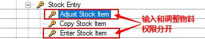
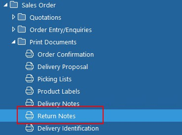

* 物料代码输入和调整权限已经分开，在Admin console里面可以控制。

* 可以在需求单中的用户权限设置界面中，使用下划线批量删除一个用户已有的所有权限。

* 可以在物料定义中设置物料的采购税率。

* 可以在仓库定义中，设置Block参数，禁止任何有关该仓库的交易。

* Cost Type中添加Cost Booking Account,如果设置将覆盖采购分类账中AAS的190项。

* 系统可以添加发票自定义字段
  1. 打开特殊功能418 - PURCHASE LEDGER - ActivateExtendedUser Defined Field for PL Invoice
  
  2. 在采购分类账的Codes中，定义添加字段的名称和定义
  
  
  3. 在程序中添加字段内容
  

* 系统可以采购订单行添加自定义字段
  1. 打开特殊功能454 - PURCHASE ORDER -Activate extended user-define fields for purchase order line
  
  2. 再采购订单的Codes中，定义添加字段的名称和定义
  
  
  3. 在程序中添加字段内容，需要修改order template。
  

* 系统提供参数控制当订单头发货日期更新，明细行中的发货日期是否更新。
  

* snap search中可以查询新增的用户自定义字段
  

* 当销售订单状态为8同时打开特殊如功能475 -  SALES ORDER - Print Return Notes时，系统提供Print Return Note打印这些订单，同时在历史中也可以重复打印。
  
  
  
  

* 设置各种文档产生文件名的模板,文档列表如下： 
1 - Sales Order Invoice/Credit Note 
2 - Consolidated Sales Order Invoice/Credit Note 
3 - Service Order Invoice/Credit Note 
4 - Purchase Order 
5 - Sales Order Invoice/Credit Note (History) 
6 - Advance Invoice 
7 - Prepayment Invoice 
8 - Consolidated Service Order Invoice/Credit Note 
9 - Contract Invoice/Credit Note 
10 - Consolidated Contract Invoice/Credit Note 
11 - Project Invoice 
12 - Sales Order Quotation 
13 - Sales Order Confirmation 
14 - Sales Order Delivery Note 
15 - Proforma Invoice 
16 - Request for Quotation (PC) 
17 - Reminder Confirmation (PC) 
18 - Reminder Delivery (PC) 
19 - Sales Ledger Statement/Reminder 
20 - Purchase Ledger Statement 
21 - Purchase Ledger Cheque Register 
22 - Purchase Ledger Automatic Payment  
23 - Payment Notification per Supplier 
24 - Interest Invoice 
25 - Consolidated Invoice/Credit Note 
  
  
  

* 采购分类账和销售分类账付款反冲
  
  
  
  
  
  
