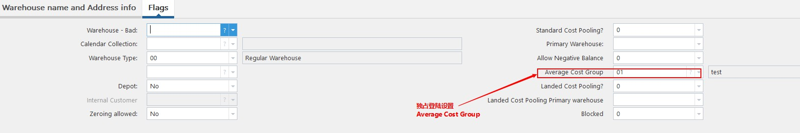

# iScala 3.3 其他设置更新（不包括普通设置，财务，库存和MPC）
************************
* 销售订单和报价的控制权限分开。
  

* 系统提供需求单多层批准，但是目前没有license
  
  

* 当修改总帐库存期间时，如果有工单在关闭期间内，将有警告。
  

* 采购收货，提供界面定制功能。
  
  
  

* Average Cost Group设置可以使得在采用加权平均成本模型时，多仓库的成本统一计算，避免多个仓库成本不一致的情况。
  
  
  
  
  
  
