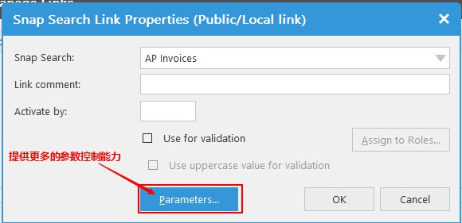
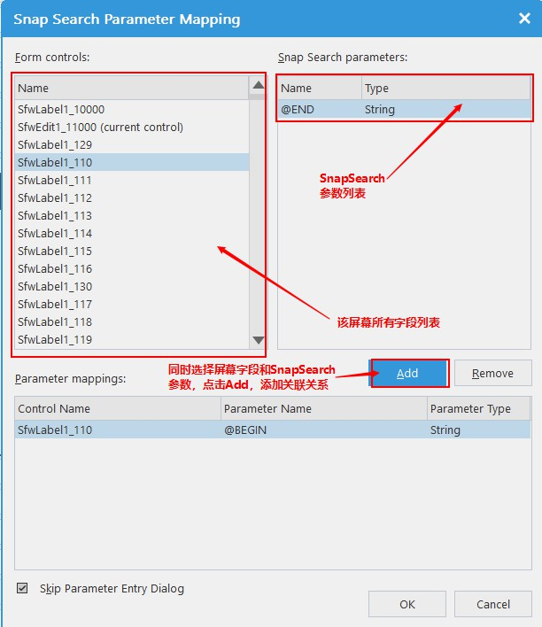
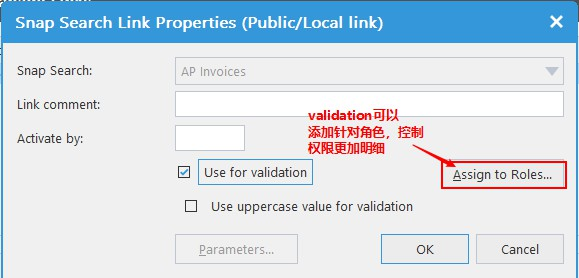

# SnapSearch功能增强
*******************

* 提供Snap Search字段名调整定义

* 提供Snap Search数字输出的精度设置，修正了之前版本输出的问题

* 提供Snap Search参数与界面字段的关联,运行Snap Search时，系统会自动填充所关联的数据

* 提供Snap Search多级查询能力，可以在Snap Search参数字段中添加其他Snap Search

* Snap Search的数据审核权限控制更加明细，可以关联到角色

