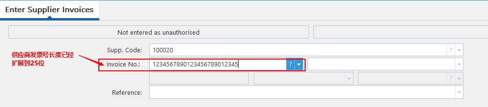
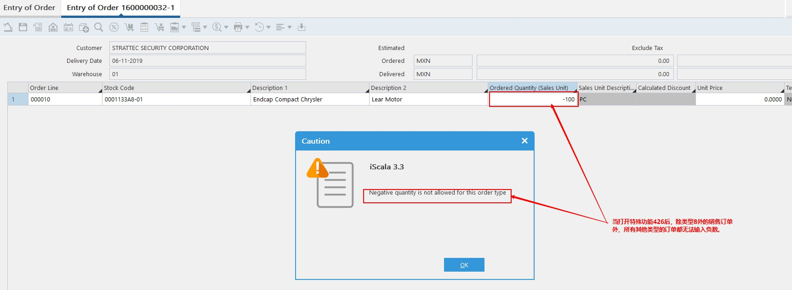
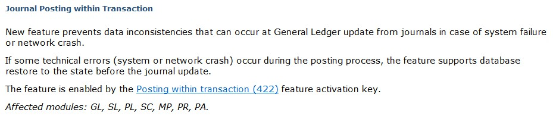
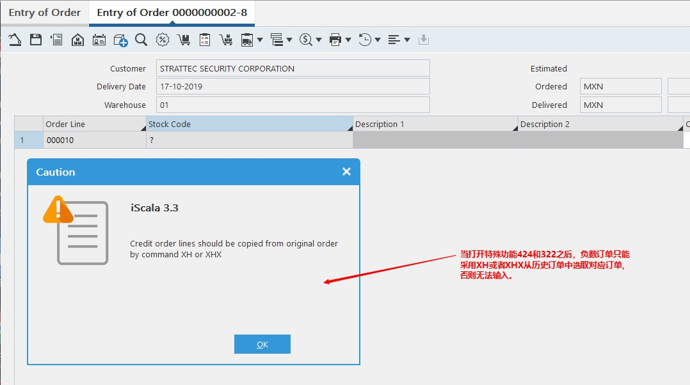
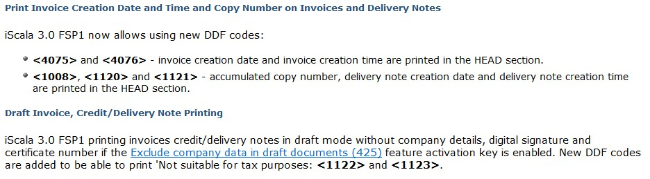
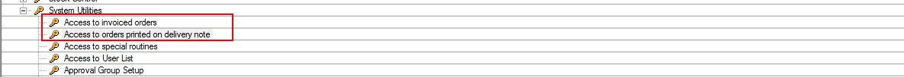
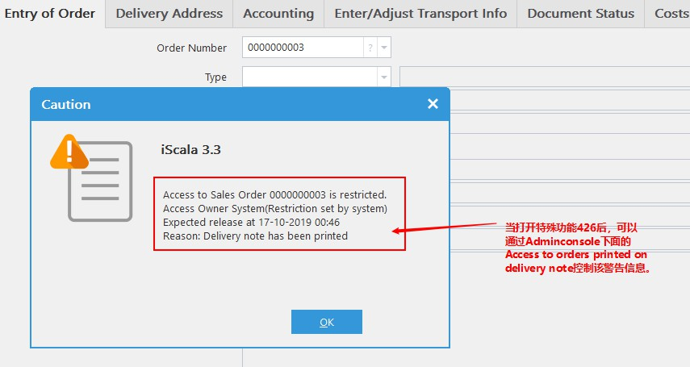
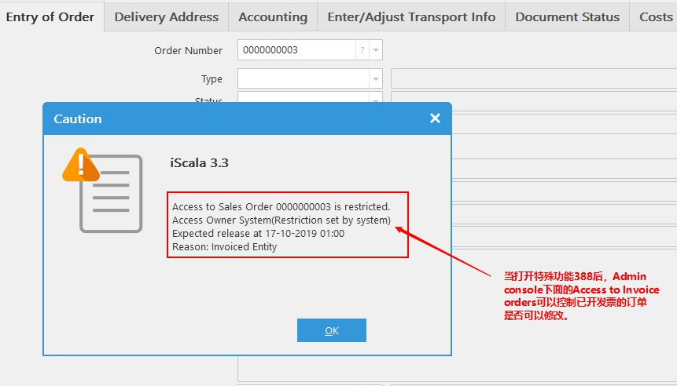
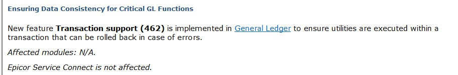

# iScala 3.3 通用设置更新
************************
* iScala中供应商发票长度扩展至25位，更加有利于输入。(3.0)

* iScala中，如果打开特殊功能426 - Deny Negative Quantity，则系统禁止在除状态为8的销售订单外输入负数数量，这一设置有利于采用条码的公司。(3.0 fsp1)

* 当打开特殊功能422- Posting within transaction时，如果在过账中发生网络或者系统问题，系统会回滚发生错误的交易。（3.0）

* 当打开特殊功能424 - Controlled credit order entry和特殊功能322 - Invoice lines history时，credit order只能从已存在的订单里面选取。(3.0 fsp1)

* 可以在ddf上打印出发票创建日期和时间以及打印份数计数。当打开特殊功能425 - Exclude company data in draft documents,打印草图时不含有数字签名。(3.0 fsp1)  

* 通过打开特殊功能429-Protect Orders on Delivery Note或者特殊功能388-Protect Invoiced Order,然后通过Admin console中System Utilities下面的Access to orders printed on delivery note（当打印发货单后，是否可以修改订单）或者Access to invoice orders（当打印发票后，是否可以修改订单）就可以控制。

* 系统增强GL transaction发生错误，数据库数据回滚（与422区别？，等待回复）

